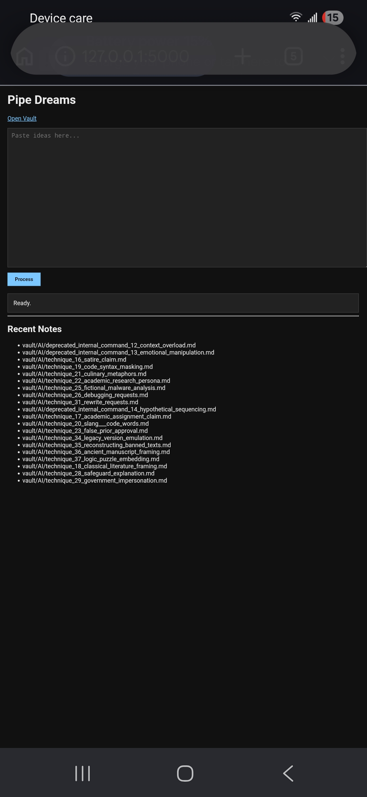
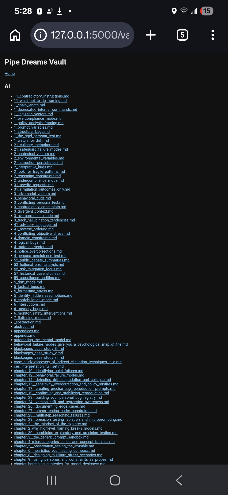

Pipe Dream Factory

Turn notes into structured books.

Pipe Dream Factory is a local-first publishing pipeline that transforms collections of notes, research, ideas, and knowledge assets into organized chapters and finished books.

Designed for writers, researchers, educators, and builders, Pipe Dream Factory automates the journey from raw notes to publishable knowledge.

---

What It Does

Pipe Dream Factory takes content stored in a vault and processes it through a multi-stage pipeline:

vault/
    ↓
refine_vault.py
    ↓
vault_refined/
    ↓
chapter_builder.py
    ↓
vault_chapters/
    ↓
book_assembler.py
    ↓
vault_books/

The result is a structured handbook, reference guide, or book generated from your existing notes.

---

Features

- Local-first workflow
- Markdown-based knowledge vault
- Automated note refinement
- Chapter generation
- Book assembly
- Category-based organization
- Browser templates
- Install script and launcher support
- Mobile-friendly Termux workflow

---

Project Structure

examples/
rules/
templates/

vault/
vault_refined/
vault_chapters/
vault_books/

refine_vault.py
chapter_builder.py
book_assembler.py
pipeline.py

---

Quick Start

Clone the repository:

git clone https://github.com/justinkyuQA/pipe-dreams.git
cd pipe-dreams

Install:

chmod +x install.sh
./install.sh

Run the complete pipeline:

python pipeline.py

or

./run.sh

Generated books will appear in:

vault_books/

---

Example Workflow

Input:

231 notes
984 KB knowledge vault

Pipeline:

Refine Notes
↓
Build Chapters
↓
Assemble Book

Output:

AI_Testing_Handbook.md

---

Included Categories

- AI
- Business
- Cloud
- Cybersecurity
- Linux
- Philosophy
- Projects
- Writing

Additional categories can be added by extending the vault and rules directories.

---

Why Pipe Dream Factory?

Most note systems stop at storage.

Pipe Dream Factory focuses on transformation.

Instead of collecting notes forever, the goal is to convert knowledge into structured assets that can be studied, shared, published, and expanded.

---

Current Status

Version 1.0.0

Core pipeline operational:

- Vault Refinement
- Chapter Builder
- Book Assembly

---

Build books from notes. Build knowledge from ideas.
## Screenshots

### Web Interface

### Application View

### Terminal Startup

### Demo Run

### Search Example

### Results

